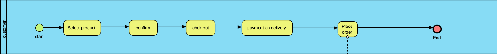
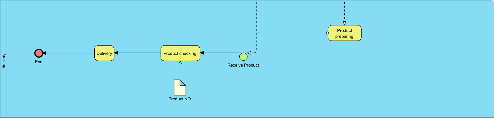
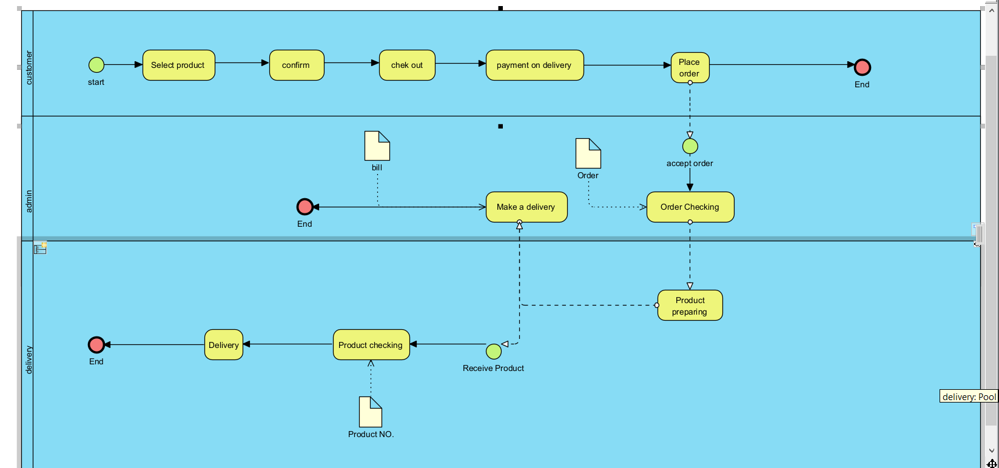

# Modern-Ecommerce-Platforms
Design and Develop Modern Ecommerce Plafform  
Wanmukhlis Waemamu

## *Abstract*
This project is a website selling canned tea leaves built on the foundation of WordPress and WooCommerce, along with the presentation of workflow processes using BPMN to provide an easy-to-understand and concise overview of business operations. Therefore, this website is an efficient and secure tool that has the capability to improve and enhance the quality of tea leaf sales in a highly effective and safe manner.

## *Introduction*
Welcome to the online store "Kusmi Tea," where we sell canned tea leaves, built on the WordPress and WooCommerce platform. We invite you to experience a unique online shopping experience when choosing to purchase high-quality tea leaves from us.

At "Kusmi Tea," we are not just known for our quality and diverse tea flavors, but we also provide a clear understanding of our business processes through the use of BPMN (Business Process Model and Notation).

Therefore, our website is not just a place to buy tea; it is also an efficient tool that supports and enhances the efficiency and safety of our tea leaf sales business at every step of the process.

## *Software and Tools Used*
- **Laragon:** [Laragon](https://laragon.org/why-laragon/) is utilized as our local development environment, providing a convenient platform for building and testing the Boo Shop E-Commerce Website before deployment.

- **WordPress:** [WordPress](https://th.wordpress.org/) serves as the primary content management system (CMS) for our website, offering a flexible and user-friendly environment for managing web content.

- **WooCommerce:** [WooCommerce](https://woocommerce.com/) is integrated seamlessly with WordPress, empowering our website with e-commerce capabilities, including product management, shopping cart functionality, and secure payment processing.

- **Elementor:** [Elementor](https://elementor.com/) Elementor is a versatile page builder plugin employed to streamline the design process. It allows for easy customization of layouts and visual elements, enhancing the website's aesthetics and functionality.

- **PDF Invoices & Packing Slips for WooCommerce:** [PDF Invoices & Packing Slips for WooCommerce](https://wordpress.org/plugins/woocommerce-pdf-invoices-packing-slips/) Create, print & email PDF invoices & packing slips for WooCommerce orders.

- **Opn Payments:** [Opn Payments](https://et.wordpress.org/plugins/omise/) has been integrated to expand our payment gateway options, providing customers with even more flexibility in how they pay for their purchases.

- **Chaty:** [Chaty](https://wordpress.org/plugins/chaty/") is a Floating Chat Widget plugin that user can click on link to get more contact with the website

## *Method*
I developed Kusmi Tea's E-Commerce Website using the **Agile method**, a flexible approach perfectly suited for the ever-evolving world of online tea sales.  

• Agile is an iterative and incremental approach to software development that emphasizes collaboration, adaptability, and customer feedback.  
• It's particularly well-suited for projects like Kusmi Tea's E-Commerce Website, which require ongoing updates, feature additions, and improvements to meet shifting customer preferences and market trends. 

My project builds upon an existing theme as the foundation for Kusmi Tea's E-Commerce Website. The theme is **Bosa Decor ShopVersion: 1.0.0 By Bosa Themes**. This theme offers essential design and user interface (UI) elements, product catalog features, responsive design, and more. We've customized and enhanced this theme to align with our specific needs, with a focus on the following aspects:

**1. Customization and Branding**: I customized the theme's appearance to align with Kusmi Tea identity by using the Element tool, ensuring a cohesive and visually appealing online presence.

**2. Plugin Integration**: I integrated key plugins like WooCommerce, PDF Invoices & Packing Slips, and Opn Payments to extend the theme's functionality.

**3. Content Management**: My project leverages the strong content management capabilities of WordPress and WooCommerce to efficiently organize and maintain our tea leaves. Here are some key points of content management within our Kusmi Tea ecommerce website:
- Product Listings: Each type of tea in my inventory is treated as a content item within WordPress. This approach enables me to create comprehensive listings for each tea, encompassing details such as tea names, origins, flavor profiles, descriptions, images of the packaging, prices, and more.
- Categories and Varieties: WordPress and WooCommerce allow me to categorize and label tea types based on their flavors, origins, and other pertinent characteristics. This categorization ensures that customers can effortlessly explore and find different tea varieties within my online store.
- Inventory Tracking: I use WooCommerce's inventory management capabilities to monitor the availability of each tea variety. This involves labeling teas as "in stock" or "out of stock," with automatic website updates.
- Content Updates: WordPress facilitates seamless updates to tea descriptions, customer reviews, and other content components. This guarantees that our website delivers current and precise information to our tea-loving customers.
- User-Generated Content: Customers can actively participate in our content by submitting reviews and ratings for the tea leaves they've purchased. WordPress manages the collection and presentation of these user-generated content contributions for our tea products.

## *Visual Overview*

My model will have three parts: 
1. Customer
2. System administrator
3. Shipping company

- The first thing that customers can do on the website is to choose the product as you like and can read the details about that product. When customers like any product, click to order. We have a payment channel and when the customer is finished, can go to check the bill as the address that has been filled in and wait for the product to be delivered home.

The aforementioned format is the same as in this picture

- And in the part of the admin, if you have received the order, you will check how many products are and will send items about the products ordered to be delivered to the shipper or delivery

The second part is the admin part.

- Then when the delivery receives the order, they will check the product number so that the product does not mix or send the wrong place. Must check before sending to customers

The third part will be a transport company

And this is a complete overview of how our business works.

