# Modern-Ecommerce-Platforms
Design and Develop Modern Ecommerce Plafform  
Wanmukhlis Waemamu

## *Abstract*
This project is a website selling canned tea leaves built on the foundation of WordPress and WooCommerce, along with the presentation of workflow processes using BPMN to provide an easy-to-understand and concise overview of business operations. Therefore, this website is an efficient and secure tool that has the capability to improve and enhance the quality of tea leaf sales in a highly effective and safe manner.

## *Introduction*
Welcome to the online store "Kusmi Tea," where we sell canned tea leaves, built on the WordPress and WooCommerce platform. We invite you to experience a unique online shopping experience when choosing to purchase high-quality tea leaves from us.

At "Kusmi Tea," we are not just known for our quality and diverse tea flavors, but we also provide a clear understanding of our business processes through the use of BPMN (Business Process Model and Notation).

Therefore, our website is not just a place to buy tea; it is also an efficient tool that supports and enhances the efficiency and safety of our tea leaf sales business at every step of the process.

## *Software and Tools Used*
- **Laragon:** [Laragon](https://laragon.org/why-laragon/) is utilized as our local development environment, providing a convenient platform for building and testing the Kusmi Tea E-Commerce Website before deployment.

- **WordPress:** [WordPress](https://th.wordpress.org/) serves as the primary content management system (CMS) for our website, offering a flexible and user-friendly environment for managing web content.

- **WooCommerce:** [WooCommerce](https://woocommerce.com/) is integrated seamlessly with WordPress, empowering our website with e-commerce capabilities, including product management, shopping cart functionality, and secure payment processing.

- **Elementor:** [Elementor](https://elementor.com/) Elementor is a versatile page builder plugin employed to streamline the design process. It allows for easy customization of layouts and visual elements, enhancing the website's aesthetics and functionality.

- **PDF Invoices & Packing Slips for WooCommerce:** [PDF Invoices & Packing Slips for WooCommerce](https://wordpress.org/plugins/woocommerce-pdf-invoices-packing-slips/) Create, print & email PDF invoices & packing slips for WooCommerce orders.

- **Chaty:** [Chaty](https://wordpress.org/plugins/chaty/") is a Floating Chat Widget plugin that user can click on link to get more contact with the website

## *Method*
I developed Kusmi Tea's E-Commerce Website using the **Agile method**, a flexible approach perfectly suited for the ever-evolving world of online tea sales.  

• Agile is an iterative and incremental approach to software development that emphasizes collaboration, adaptability, and customer feedback.  
• It's particularly well-suited for projects like Kusmi Tea's E-Commerce Website, which require ongoing updates, feature additions, and improvements to meet shifting customer preferences and market trends. 

My project builds upon an existing theme as the foundation for Kusmi Tea's E-Commerce Website. The theme is **Bosa Decor ShopVersion: 1.0.0 By Bosa Themes**. This theme offers essential design and user interface (UI) elements, product catalog features, responsive design, and more. We've customized and enhanced this theme to align with our specific needs, with a focus on the following aspects:

**1. Customization and Branding**: I customized the theme's appearance to align with Kusmi Tea identity by using the Element tool, ensuring a cohesive and visually appealing online presence.

**2. Plugin Integration**: I integrated key plugins like WooCommerce, PDF Invoices & Packing Slips, and Chaty to extend the theme's functionality.

**3. Content Management**: My project leverages the strong content management capabilities of WordPress and WooCommerce to efficiently organize and maintain our tea leaves. Here are some key points of content management within our Kusmi Tea ecommerce website:
- Product Listings: Each type of tea in my inventory is treated as a content item within WordPress. This approach enables me to create comprehensive listings for each tea, encompassing details such as tea names, origins, flavor profiles, descriptions, images of the packaging, prices, and more.
- Categories and Varieties: WordPress and WooCommerce allow me to categorize and label tea types based on their flavors, origins, and other pertinent characteristics. This categorization ensures that customers can effortlessly explore and find different tea varieties within my online store.
- Inventory Tracking: I use WooCommerce's inventory management capabilities to monitor the availability of each tea variety. This involves labeling teas as "in stock" or "out of stock," with automatic website updates.
- Content Updates: WordPress facilitates seamless updates to tea descriptions, customer reviews, and other content components. This guarantees that our website delivers current and precise information to our tea-loving customers.
- User-Generated Content: Customers can actively participate in our content by submitting reviews and ratings for the tea leaves they've purchased. WordPress manages the collection and presentation of these user-generated content contributions for our tea products.

## *Visual Overview*

### Website overview
**HomePage**

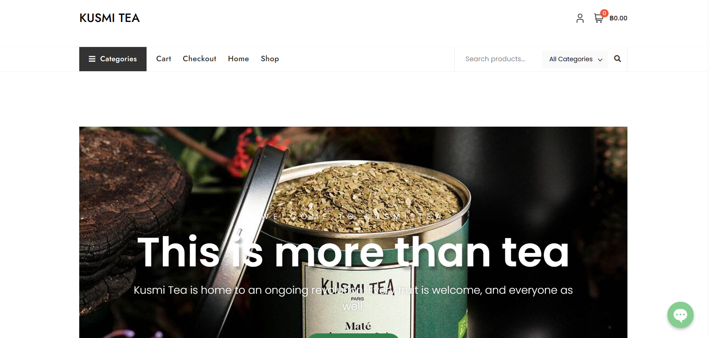

**Shoppage**

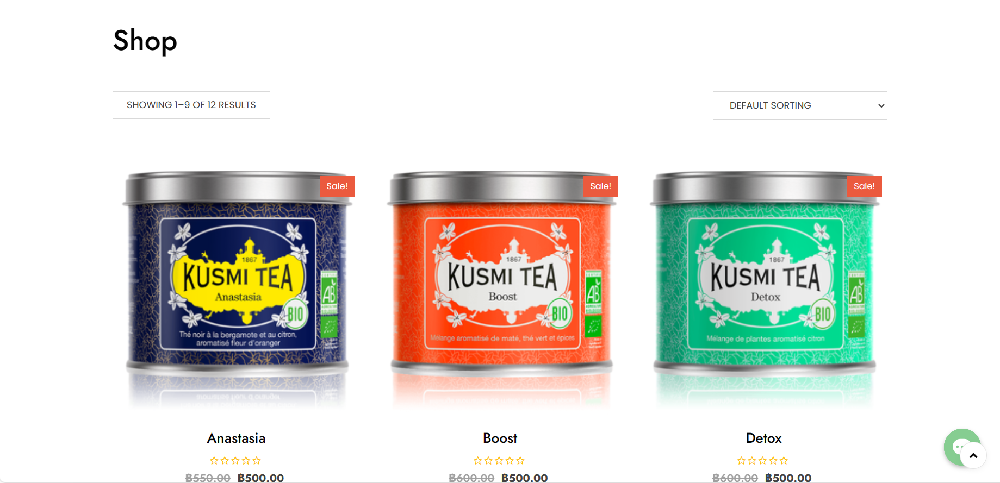

**Cart**

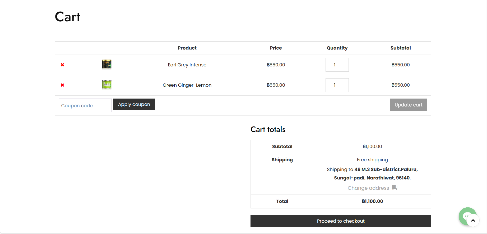

### BPMN Diagram

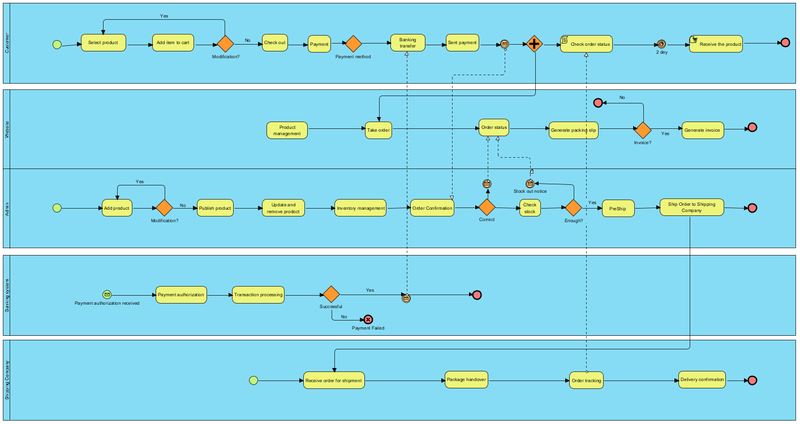

#### All Pools in BPMN
- Customer
- Admin
- Website
- Banking system
- Shipping company

#### Customer pool
Represents the group of customers interacting with the platform.

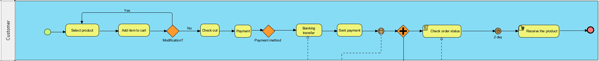

- **Start Event (Green Circle):** Marks the beginning of the customer's journey on the platform.

- **Select Products:** The customer selects the desired products from the available options.

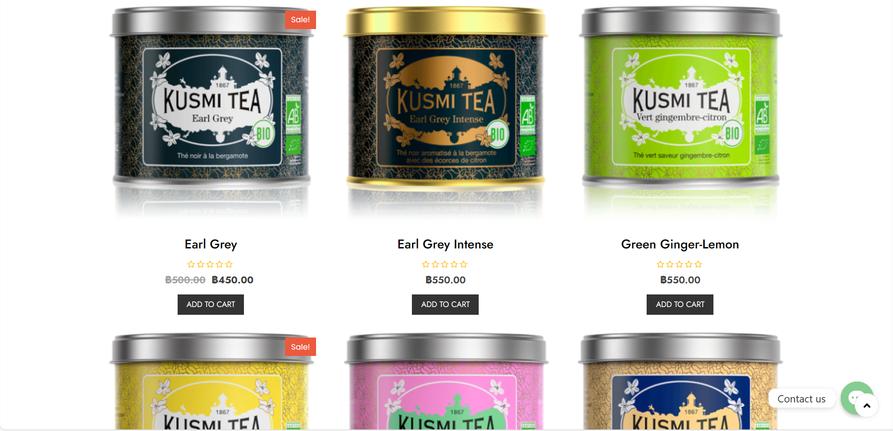

- **Add item to cart:** after select product process, customer will check in the cart. If the customer is satisfied with the selected product. they will go to checkout process. If not they will go back and select more item.

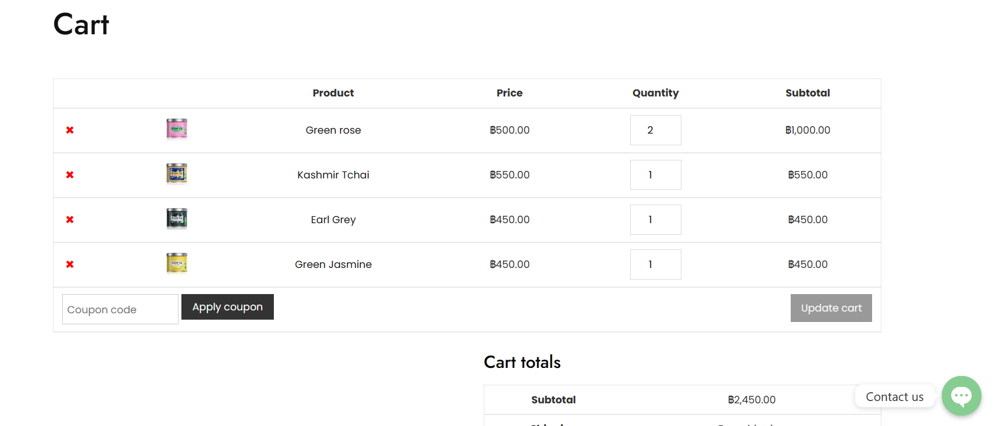
      
- **Checkout Process:** The process to Checkout the product. 

  - **Fill the shipping detail:** The customer fill their shipping detail.

      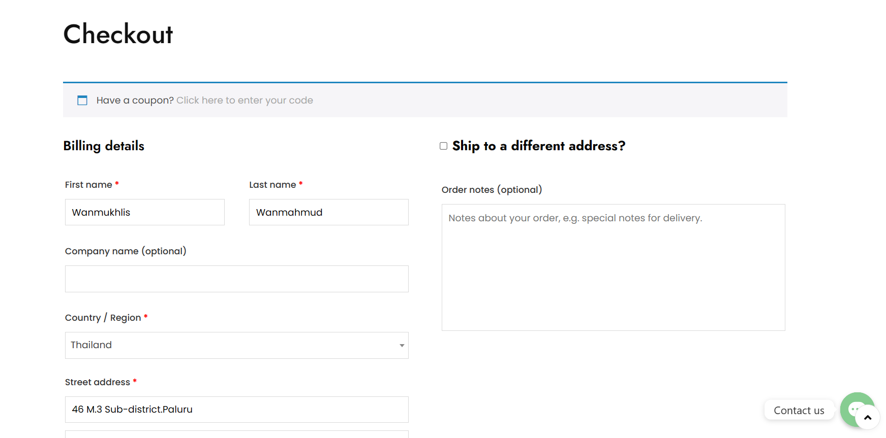
  
  - **Identify payment method:** customer choose the payment method. In my wetsite have 2 ways are Cash on delivery and Bank transfer.

      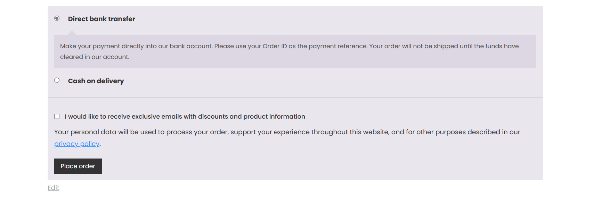

  - **Payment process:** The customer make a payment on what they choose (Cash on delivery or Bank transfer). For Bank transfer, customer have to sent the payment proof to admin by using contact form to sent photo or customer can sent via messenger, Line, E-mai.

      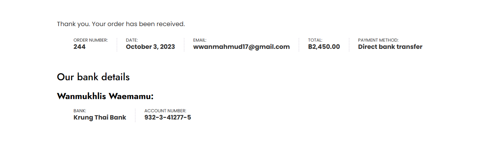

  - **Review order process:** In this process, customer can chect that the order is success or not. If not success, the order will cancel. If order is success, customer just wait for order to shipping.

   - **Recieve the  product process:** Recieve the product from shipping company.

  - **End Event

#### Admin pool

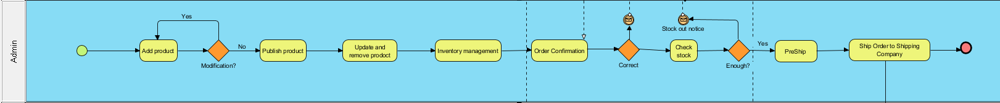

- **Add product:** This task represents the process of adding a new product to your e-commerce store's catalog. It includes entering product details, assigning categories, and setting pricing.

  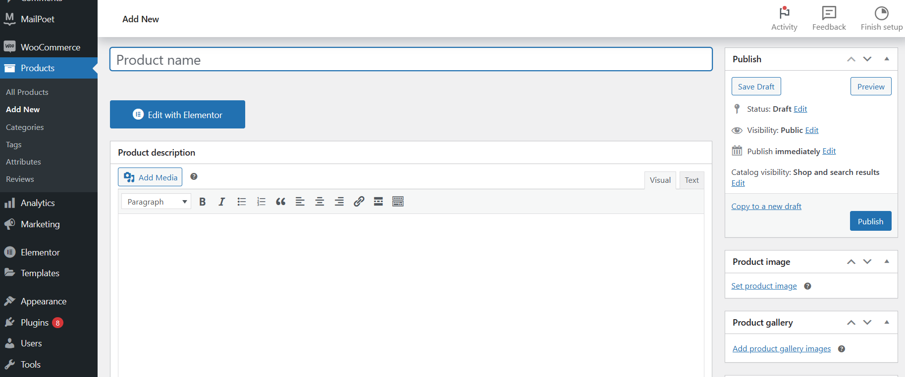

  - **Publish Product:** This task involves making the approved product visible to customers on the website. It ensures that the product is included in relevant search results and categories.
  - **Update Product Information:** This task allows admins to modify existing product details, such as descriptions, prices, or images. It's used for maintaining accurate product information.
  - **Remove Product:** When a product is discontinued or permanently out of stock, this task is used to remove the product from the website. It ensures customers can no longer purchase the item.

    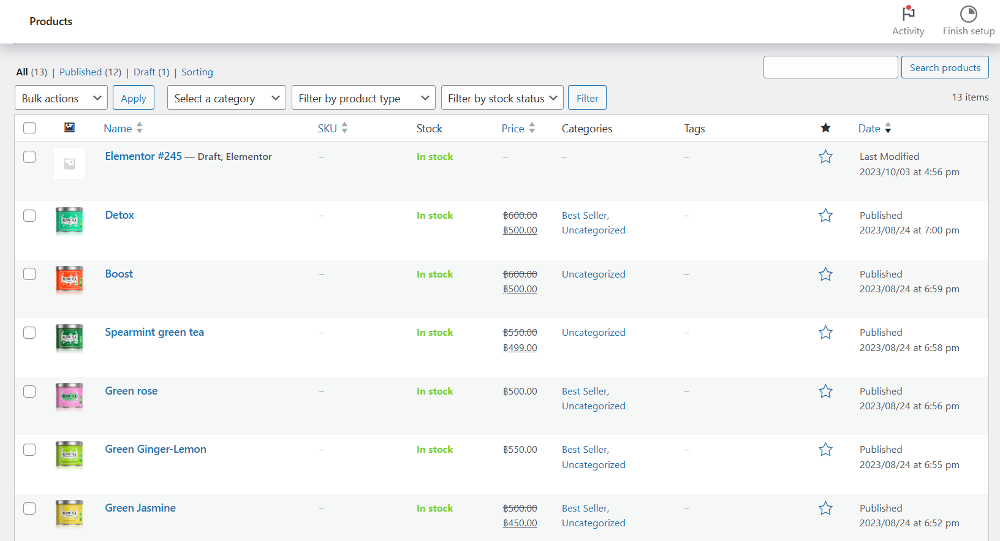

  - **Inventory Management:** This task involves monitoring and managing product inventory levels. Admins may use this task to adjust stock levels, track product availability, and reorder items when necessary.
   
    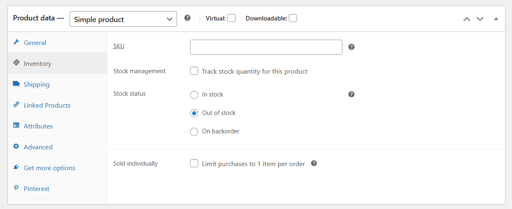

  - **Check order:** Admin will check the order list to see if there are any new orders or not. If there is a new order, the admin will go to the next task.

    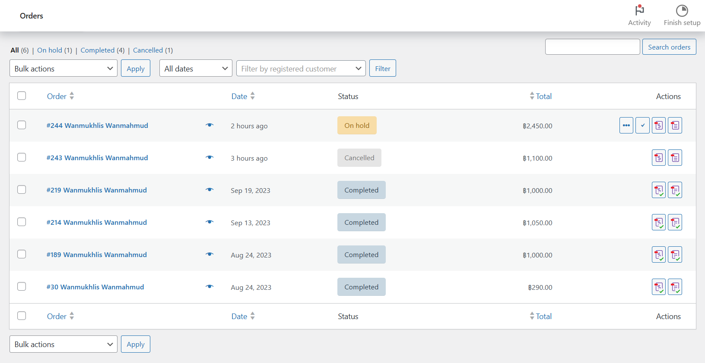

  - **Check slip and confirm order process:** This process admin will check the slip of payment and confirm order.

    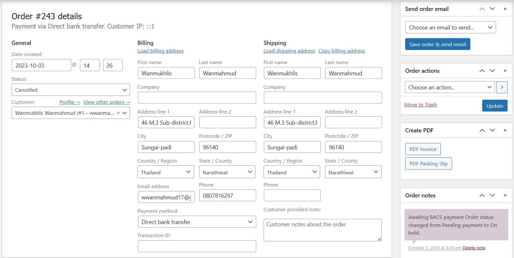

  - **Correct gataway:** when admin check correctness about payment. If correct, It will go to Check Stock process. If not correct, It will cancel the order.
  - **Check Stock process:** admin will check stock. If have product enough, It will go to next process (Prepare order for shipping process). If out of stock, the order will cancel.
  - **Prepare order for shipping process:** this task is to prepare product for shipping or pack items properly for delivery.
  - **Ship order to shipping company process:** This process is about sent product to shipping company.

#### Website pool

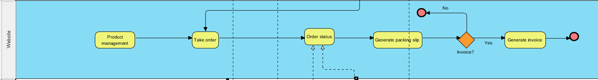

- **Product management:** this task is about when admin manage about product such as adding new products, updating product information, or remove product. website will handle these things.
- **Take Order:** this represents the point at which customer order details are sent for processing.
- **Order status:** to show on website about order status that the customer will check such as pending payment, processing, completed, or cancelled.

  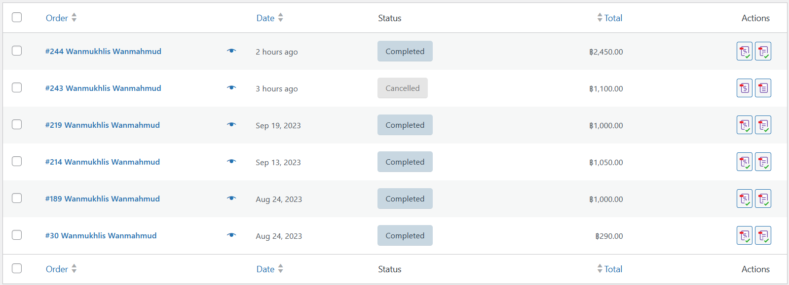
  
 - **Generate Packing Slip:** Website will generate packing slip for shipping.

   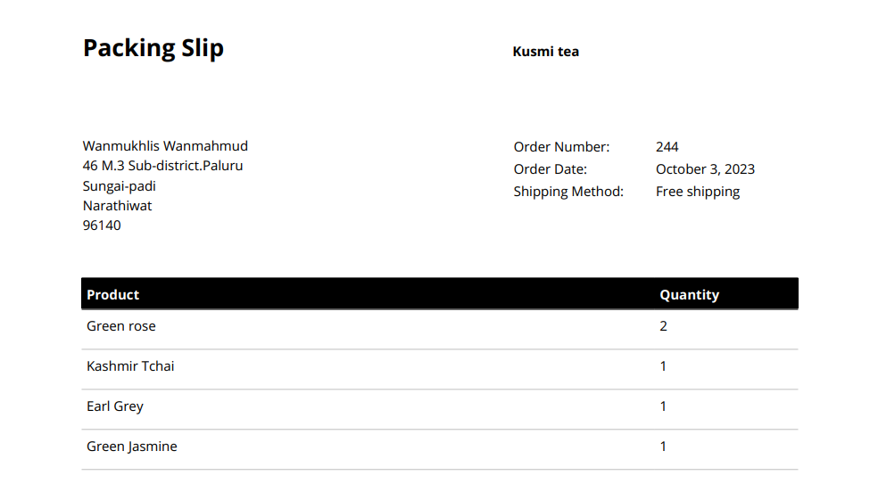

- **Invoice gataway:** this task for customer who need a invoice.
- **Generate Invoice:** Website will generate invoice for customer.

  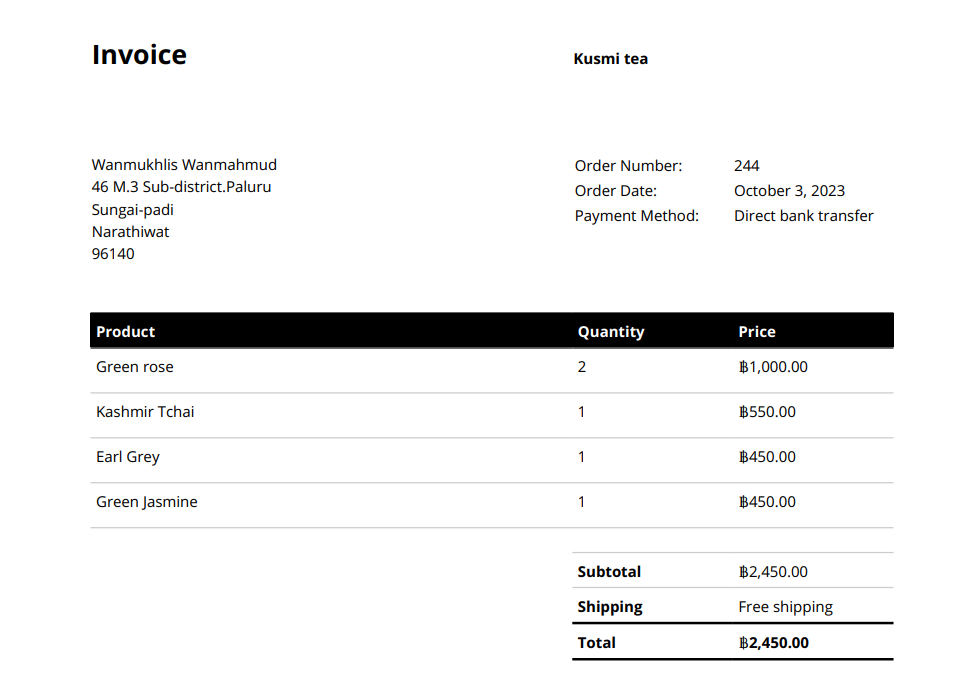

- **End event

